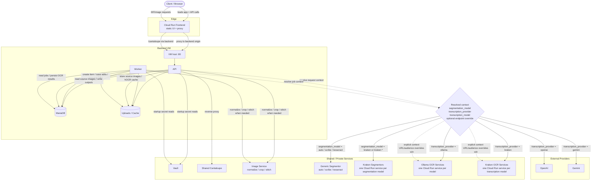

# Scribe


Scribe is a web-based OCR correction tool. Upload images or point it at a IIIF manifest, run OCR, then fix the results visually in an image-aligned text editor. All data is stored per-user and the API is defined end-to-end in protobuf with Connect RPC.

The application now runs as separate `frontend`, `api`, and `worker` processes.
The frontend serves the web app and proxies backend routes. The API hosts
Connect RPC, annotation, and IIIF HTTP routes. The worker consumes background
transcription jobs.

## Direction

Scribe is standardizing on IIIF Presentation 3 `AnnotationPage` JSON as the
canonical persisted OCR correction model, using the IIIF Text Granularity
Extension for page/block/paragraph/line/word/glyph structure:
https://iiif.io/api/extension/text-granularity/

That means:

- IIIF is the canonical saved correction state
- hOCR, PageXML, ALTO, and plain text are export/import formats
- editor-specific UI state is transient and not the canonical storage model
- revision metadata such as `updated_by`, `updated_at`, and `revision` is stored
  adjacent to the canonical IIIF payload
- the API exposes annotation and text-editing actions that editor plugins can
  call directly rather than reimplementing split/join/transcription logic in
  the browser
- the same project also ships a standalone web app for item ingestion,
  management, OCR generation, and QA editing

The editor is designed as a custom text-first OCR correction workflow built on
top of canonical IIIF annotation state.

## Quick start

```bash
cp sample.env .env
cp docker-compose.override-example.yaml docker-compose.override.yaml
bash generate-secrets.sh
docker compose up --build
```

The local override starts the standalone `segmentor` and `image-service`
containers. The main `api` and `worker` image is now the lean remote-service
build by default and expects those helper services to exist for OCR and image
manipulation work.

| Service | URL |
|---------|-----|
| Web app | http://localhost |
| API + Annotation API | http://localhost:8080 |
| IIIF image server (Cantaloupe) | http://localhost/cantaloupe |
| Worker health | `docker compose logs worker` or `http://worker:8080/healthz` inside the compose network |

## Creating items

The landing page offers four ways to create an item:

| Tab | What happens |
|-----|-------------|
| **Image URL** | OCR runs immediately; editor opens automatically |
| **Single upload** | Upload one image; OCR runs; editor opens automatically |
| **Multi-upload** | Upload several images into one item; appears in the table for editing |
| **IIIF Manifest** | Fetches all canvases from the manifest; appears in the table |

After OCR, click **Edit** on any item to open the page editor where you can
correct line and word text against the image.

## Architecture

```
cmd/api/            HTTP API process
cmd/worker/         Background transcription worker process
web/server.mjs      Frontend runtime that serves the SPA and proxies backend paths
internal/
  server/           Connect handlers, canonical AnnotationPage routes, crosswalk routes
  store/            MariaDB access via sqlc
proto/              Protobuf definitions (Buf managed)
web/src/
  main.ts           Router (~10 LOC)
  api/              Connect client wrappers (items, processing, transport)
  pages/            home.ts (landing page), editor.ts (editor shell)
  lib/              Pure utilities
mirador-scribe/
  src/              Repo-owned Mirador v4 OCR editor plugin + annotation adapter
sqlc/               SQL queries + generated Go code
```

Canonical data model:

- Persist one IIIF Presentation 3 `AnnotationPage` per page/canvas
- Use IIIF Text Granularity Extension semantics for line/word/glyph annotations
- Preserve the finest source granularity available during import, such as word
  boxes from hOCR `ocrx_word`
- Store revision and workflow metadata adjacent to the canonical annotation JSON
- Export repository-facing formats such as hOCR/PageXML/ALTO from that canonical state

API/editor contract:

- the backend is the canonical source for annotation mutations such as line
  splitting, line joining, word splitting, word joining, and retranscription
- editor plugins should call those API operations and then reload or reconcile
  the returned IIIF annotations
- this keeps plugin implementations thinner and makes the same API usable from
  Mirador or other IIIF-capable editors


## Build and test

```bash
# Backend
make lint
make test
make build

# Regenerate proto stubs and SQL
make proto
make sqlc
make generate

# Frontend (from web/)
npm install
npm run build
npm run serve

# Frontend container
make build-frontend
```

SQL query definitions live under [sqlc/queries](/workspace/sqlc/queries). The
checked-in [internal/db](/workspace/internal/db) package mirrors those queries
today and should be refreshed from them with `make sqlc` when the tool is
available in the development environment.

## Runtime config

Non-secret runtime settings live in [config.yaml](/workspace/config.yaml). The
container bakes in embedded defaults and then reads `/etc/scribe/config.yaml`
at startup when it is mounted by Docker Compose or Terraform-managed runtime
deployment. Selected string values in that YAML support `${VAR}` and
`${VAR:-default}` interpolation from the container environment.

Secrets do not live in `.env` or `config.yaml`. They are loaded from Vault on
startup using the paths configured under `vault.paths` in `config.yaml`. The
Vault address itself is non-secret and also lives in `config.yaml` as
`vault.address`.

On deployed GCP VMs, Scribe authenticates to Vault with the GCP auth method.
It first tries a mounted service-account credential file and then falls back to
the VM metadata service if that file is not available. A static Vault token is
only needed as an optional local-development fallback.

For local Docker Compose only, [sample.env](/workspace/sample.env) defines
`SCRIBE_API_IMAGE`, `SCRIBE_FRONTEND_IMAGE`, and the published host ports used
by the local override stack. Copy
[docker-compose.override-example.yaml](/workspace/docker-compose.override-example.yaml)
to `docker-compose.override.yaml` to run the local frontend on `:80` while the
API stays on `:8080`.

The backend containers now expect a Docker Compose secret file at
`./secrets/GOOGLE_APPLICATION_CREDENTIALS`, mounted in-container at
`/run/secrets/GOOGLE_APPLICATION_CREDENTIALS`. That file is provisioned
externally in deployed environments. For local/CI compose runs,
`generate-secrets.sh` creates a `{}` placeholder when the file is missing so
the secret mount exists without fabricating real credentials.

When `VAULT_ADDRESS` is configured, `generate-secrets.sh` also rewrites
`./secrets/mariadb_password` and `./secrets/mariadb_root_password` from the
Vault `secret/scribe/database` secret before Docker Compose starts MariaDB, so
the database container and the app use the same credentials source. It does
that through the init-only `vault-init` Compose service, which signs into Vault
from `./secrets/GOOGLE_APPLICATION_CREDENTIALS` inside Docker rather than
calling the metadata server, so it still works when Docker traffic to metadata
is blocked.

Use `make vault-secrets` to list, read, or update the required app secrets in
Vault. The helper prompts for `dev` vs `prod`, uses your current
`gcloud auth print-access-token` for the proxy's `X-Admin-Token`, and then
logs into Vault through the `google-jwt` admin role for your active gcloud
account unless you explicitly override `VAULT_TOKEN`.

Terraform now treats Vault as two long-lived servers: shared `dev` and `prod`.
Preview environments and local dev point at the shared `dev` Vault. Each
deployment still gets its own Vault GCP auth role, so preview service accounts
do not need to share a single global role binding.

For local Terraform applies, the local deploy helper may need Artifact Registry
push credentials so it can publish missing frontend/OCR GAR images before
Terraform runs. Before running `make tf-dev`, `make tf-preview`, or
`make tf-prod` locally, configure Docker for `us-docker.pkg.dev`:

```bash
gcloud auth login
gcloud config set project <your-gcp-project-id>
gcloud auth configure-docker us-docker.pkg.dev
```

This repo currently reads Docker auth from `~/.docker/config.json`. Your user
also needs write access to `projects/<project>/locations/us/repositories/internal`.

Global runtime values such as `PUBLIC_BASE_URL`, `VAULT_ADDRESS`,
`VAULT_GCP_AUTH_ROLE`, `CANTALOUPE_IIIF_INTERNAL_BASE`, `OLLAMA_URL`,
`OLLAMA_AUDIENCE`, `OLLAMA_MODEL_ENDPOINTS_JSON`, `SEGMENTATION_SERVICE_URL`, `IMAGE_SERVICE_URL`,
`SEGMENTATION_MODEL_ENDPOINTS_JSON`, `KRAKEN_URL`, `KRAKEN_AUDIENCE`,
`KRAKEN_MODEL`, `KRAKEN_MODEL_ENDPOINTS_JSON`, and `VAULT_TOKEN` are now
intended to be injected as container env vars and resolved by `config.yaml`
interpolation or startup parsing rather than by rewriting the mounted file on
disk.

Contexts can optionally override the global Ollama URL and audience, which is
the recommended setup when each model is deployed as its own cached Cloud Run
service. When the selected Ollama URL points at a private Cloud Run service,
Scribe automatically sends an ID token if the host is a `*.run.app` service
URL. Set `llm.ollama.audience` or the context-specific audience only when the
Cloud Run service uses a custom audience. When no explicit context override is
set, Ollama model routing now falls back to `OLLAMA_MODEL_ENDPOINTS_JSON`
keyed by `transcription_model`.

Kraken now follows the same one-service-per-model topology. Segmentation routes
by the context `segmentation_model` through `SEGMENTATION_MODEL_ENDPOINTS_JSON`,
and Kraken transcription routes by `transcription_model` through
`KRAKEN_MODEL_ENDPOINTS_JSON`. Contexts can still override the Kraken
transcription URL and audience directly when needed.

## IIIF endpoints

```
GET  /v1/item-images/{id}/manifest        IIIF Presentation v3 manifest
GET  /v1/item-images/{id}/hocr            Current persisted hOCR document
GET  /v1/item-images/{id}/annotations     IIIF annotation page bootstrap/export
GET  /v1/events                           Server-sent event stream for job + annotation lifecycle events
GET  /auth/me                             Current auth/session state
GET  /auth/google                         Google OAuth login
GET  /auth/callback/google                Google OAuth callback
GET  /auth/api-keys                       List API keys for the active workspace
POST /auth/api-keys                       Create a workspace-scoped API key
DELETE /auth/api-keys/{key_id}            Revoke a workspace-scoped API key
GET  /auth/provider-secrets               List Vault-backed provider secrets visible in the active workspace
POST /auth/provider-secrets               Create a workspace- or user-scoped provider secret
DELETE /auth/provider-secrets/{secret_id} Delete a provider secret
```

The application API is proto-first. New API operations should be defined in
protobuf and consumed through generated Connect clients.

Annotation and OCR operations are exposed on these Connect services:

```
POST /scribe.v1.ItemService/*
POST /scribe.v1.ImageProcessingService/*
POST /scribe.v1.ContextService/*
POST /scribe.v1.AnnotationService/*
```

Plain HTTP routes should exist only when there is a concrete resource-URL
reason not to use RPC. The `GET /v1/item-images/{id}/manifest`,
`GET /v1/item-images/{id}/annotations`, and `GET /v1/item-images/{id}/hocr`
routes are examples of that exception: they expose dereferenceable IIIF/OCR
documents that external viewers and IIIF clients fetch directly.

## Auth model

Google OAuth is the only interactive login path. The shipped runtime does not
support anonymous mode, local username/password auth, or an auth toggle.

Every authenticated request runs inside a workspace. Browser sessions default
to the caller's personal workspace, and can target another workspace membership
with `X-Scribe-Workspace-ID`. API keys are pinned to exactly one workspace and
ignore any workspace override header.

API keys are intended for scoped frontend and integration use cases such as a
Drupal-hosted Mirador plugin calling Scribe to create items, edit annotations,
or save OCR output. They are created by workspace admins via `/auth/api-keys`
and may be limited by both a workspace role (`admin`, `write`, `create`,
`read`) and optional scopes such as `items:*`, `annotations:write`, or
`transcription:read`.

Provider API keys are stored separately from the relational DB. Scribe stores
only provider-secret metadata in MariaDB and writes the actual secret material
to Vault. The contexts page can create personal or workspace-scoped provider
secrets. Runtime resolution prefers a personal secret over a workspace secret
for the same provider. Gemini is wired end-to-end today for enrichment,
background transcription, and other context-driven OCR paths.

Connect and HTTP clients may authenticate with either:

```text
Authorization: Bearer <api-key>
X-Scribe-API-Key: <api-key>
```

For browser or plugin code in this repo, [web/src/api/transport.ts](/workspace/web/src/api/transport.ts)
exports `createScribeTransport(...)`, which can attach API key and workspace
headers to a Connect transport.

## Events and webhooks

Scribe emits a small CloudEvents-style event set from the backend. Clients can
consume those events either through `GET /v1/events` over SSE or by setting
`webhooks.urls` in [config.yaml](/workspace/config.yaml) to fan out each event
as `application/cloudevents+json`.

Current event types:

- `dev.scribe.transcription.task.started`
- `dev.scribe.transcription.task.completed`
- `dev.scribe.transcription.completed`
- `dev.scribe.transcription.failed`
- `dev.scribe.annotations.created`
- `dev.scribe.annotations.published`

Use `transcription.task.completed` to drive per-line progress in the UI. Use
`annotations.created` and `annotations.published` for external integrations such
as Islandora. Save does not publish: `annotations.published` is emitted only
after the explicit `POST /scribe.v1.AnnotationService/PublishItemImageEdits`
action.

## Deployment direction

The current deployment/auth refactor plan lives in
[docs/infra-auth-plan.md](/workspace/docs/infra-auth-plan.md). The current
deployment shape is:

- separate `frontend`, `api`, and `worker` deployments
- backend Go image stays on the VM
- frontend image is deployed as the optional `frontend` Cloud Run sidecar next
  to ppb and proxies backend paths back to the VM
- shared production Cantaloupe managed from this repo's Terraform
- shared private Ollama model services managed from this repo's Terraform
- a shared production HTTPS load balancer for the app and Cantaloupe
- a self-hosted Vault deployment managed from this repo's Terraform
- Google OAuth plus Connect interceptor-based authorization
- Vault-backed storage for user-supplied provider keys
- session hOCR state persisted in the database instead of local disk

Editor-oriented annotation operations are exposed on `AnnotationService` so
plugins can delegate structural OCR edits to the backend:

```
POST /scribe.v1.AnnotationService/SplitAnnotationIntoWords
POST /scribe.v1.AnnotationService/SplitAnnotationIntoTwoLines
POST /scribe.v1.AnnotationService/MergeAnnotationsIntoLine
POST /scribe.v1.AnnotationService/MergeWordsIntoLineAnnotation
POST /scribe.v1.AnnotationService/TranscribeAnnotation
POST /scribe.v1.AnnotationService/TranscribeAnnotationPage
```

## Contexts and metrics

Contexts bundle the OCR/transcription settings used to process or enrich an
image. A context can include:

- a segmentation model
- a transcription provider/model
- additional context-selection metadata used to infer the best context from the
  supplied image or related metadata

Scribe seeds these system contexts on startup:

- `Default`
  Runs both `tesseract` segmentation and the in-repo `scribe` custom segmentor,
  then keeps whichever finds more words.
- `Tesseract OCR`
  Uses Tesseract segmentation and Tesseract transcription directly.
- `Scribe Custom`
  Uses the custom segmentor, crops by detected line, sends each line to the
  configured LLM provider, and assembles the result back into line-level OCR.
- `Kraken BLLA`
  Uses Kraken page segmentation with its default BLLA model, then crops by
  detected line and sends each line to the configured LLM provider.

Set a context segmentation model to `kraken` to use the default Kraken BLLA
segmenter, or `kraken:<model-id>` to pin a specific Kraken model.

When `config.yaml` sets `llm.provider: ollama` and `llm.ollama.model` is left
at its default, Scribe uses `glm-ocr:bf16`.

When `llm.ollama.url` targets a private Cloud Run Ollama deployment, the shared
`htr` provider client now attaches a Google identity token automatically. The
default audience is the Cloud Run service URL; `llm.ollama.audience` exists for
the rare case where you configured a custom audience explicitly.

For images uploaded or supplied without existing hOCR, the default system flow
is:

1. Run the Tesseract segmentor and the Scribe custom segmentor.
2. Compare the number of detected words.
3. Use the winning segmentation path for OCR generation.
4. If Tesseract wins, keep Tesseract's text directly.
5. If the Scribe segmentor wins, run the line-crop LLM transcription path.

The backend exposes context resolution so ingestion and editor operations can
choose a context explicitly or let the server pick one when enough information
can be inferred. OCR runs are stored with the resolved context so context-level
metrics aggregate against the context that was actually used.

Scribe records edit metrics to evaluate context quality. The primary metric
today is document-level Levenshtein distance between:

- the plain-text document produced by the app originally
- the plain-text document represented by the user-corrected final result

This gives a simple measure of how much correction a context required.
Segmentation quality metrics are planned but still TBD.

## Product Model

Scribe supports two primary workflows:

1. Low/no-touch OCR generation
   - ingest images or manifests
   - generate canonical IIIF annotation pages
   - export hOCR/PageXML/ALTO/plain text
   - optionally publish results back to a parent repository system

2. Human QA correction
   - load canonical IIIF annotation pages in the editor
   - edit text and geometry with a text-first workflow
   - save new revisions
   - export or publish corrected results

## Deferred work

Word-level OCR accuracy is not a default workflow yet. The current automatic
transcription path crops by line and sends each line image to an LLM, then
writes the result back as line text. Supporting first-class word-by-word OCR
would require substantially more model calls and image crops, which would raise
costs materially. For now, Scribe creates line annotations by default and lets
the editor split a line into words when finer correction work is actually
needed.
